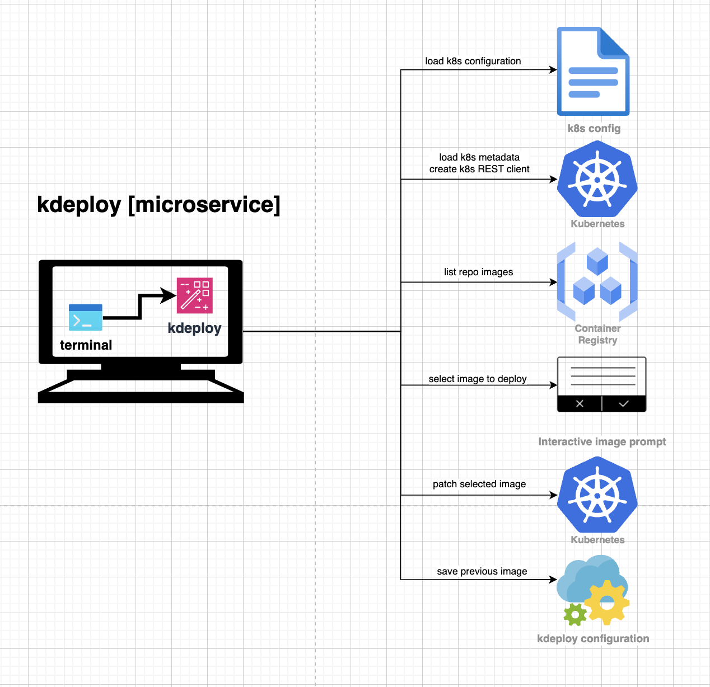
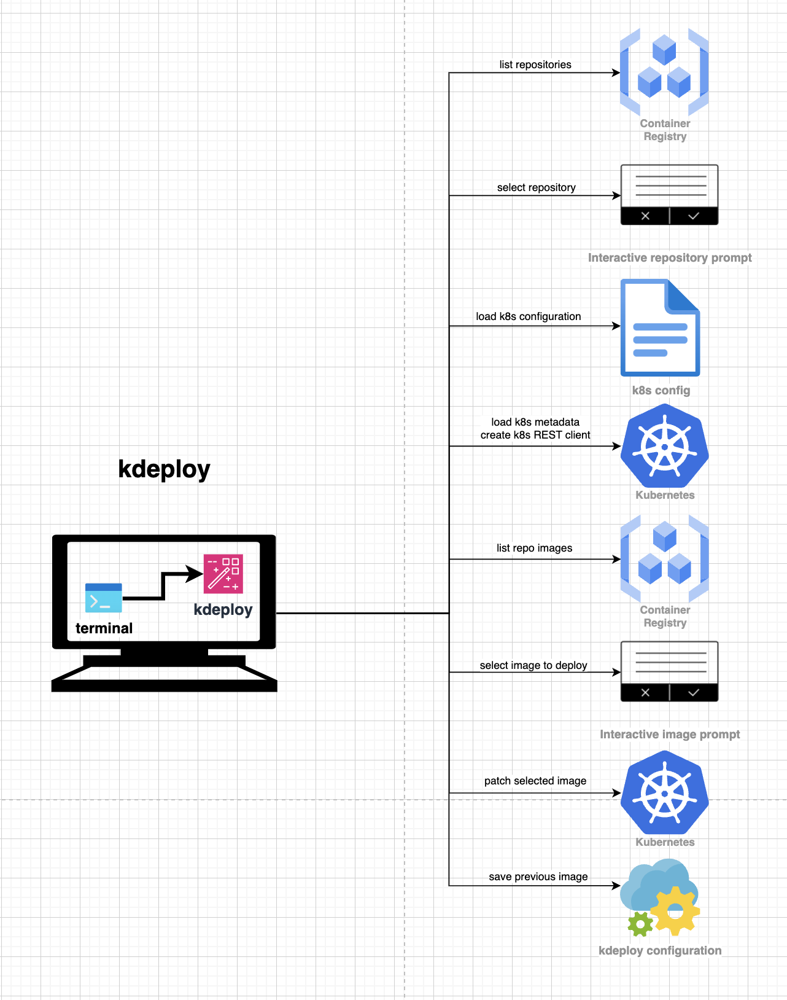
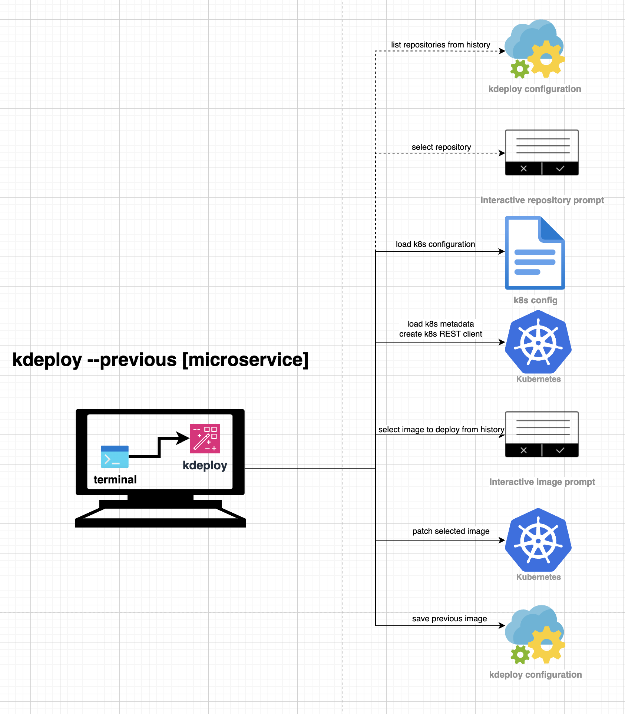

# KubernetesDEPLOY

Kubernetes deployment straight outta your comfy terminal.

---
## Backstory or Why? 🧐

I freaking love Kubernetes! But I freaking hate Continuous Delivery tools during the development process!\
Don't get me wrong, CD tools are crucial nowadays. Deployments became much more stable and, therefore, more painless - in production.

But is it for the day-to-day development process? Of course, yes - the answer of any sane developer.\
And I agree. But still, how many buttons on shiny UI need to be pressed to do deployment? Open the CD site in the browser, login or SSO, 2FA via an app, find a suitable pipeline, recall and enter the right environment, microservice, proper infra definitions, and required Docker image.
Wow, wait a minute... and repeat that over again every time?

So, why not automate it?\
The motto of any self-respecting developer.\
With each filthy CD cycle, when I was forced to quit my code editor or terminal, my mind started to become poisoned with this paranoic question. Poisoning grew alongside anger, irritation, and annoyance.

Hence, on the third day, I started writing a Bash script. The initial version, which can be found in the [legacy](legacy) folder. Doing its job, but clumsy, unmaintainable, and slow (still cool 😎 , check it out if you're a Bash guy).
However, the demand for new features, and its challenges when writing them in Bash, paved my path to Golang and the current contents of this brilliant repository.

---
## Its Strengths or How it works? 💪

>_ kdeploy [microservice]

Deploy specific microservice.

Initiates K8S REST clients based on local .kube configuration. Searches for images of requested microservice in Google Container Registry, prompts you to interactively select an image for deployment (arrows navigation, search features), and sets the selected image in the workload. Kubernetes will handle deployment afterwards. 

> kdeploy ms-training

>_ kdeploy

If microservice was not specified - it obtains possible repositories from the registry and prompts you to select it first. Then proceeds to the original flow.

> kdeploy

>_ kdeploy --previous [microservice]

kdeploy remembers every deployment you made and allows you to redeploy previous images from history.

> kdeploy --previous ms-training

Running deploy-previous mode without specifying microservice results in prompting microservice first from your previous deployments.

---

### Configuration

kdeploy requires two configuration properties - `registry` and `repository`.  
The `registry` is where to look for your images (e.x. `us.gcr.io`), and the `repository` is the path to your images. If not set you will be prompted to enter them.  
Set them using:
> kdeploy config set [registry|repository] [value]

Or edit configuration file manually: 
> kdeploy config edit

Assumed that all workloads are of Deployment type. If some are StatefulSets, set them in configurations (comma separated):  
>kdeploy config set statefulsets ms-events,ms-core

### How to make it run?

Run `go build` command in the root directory to build the binary file.
Then place it on at `/usr/local/bin` for convenient access anywhere on your system.
